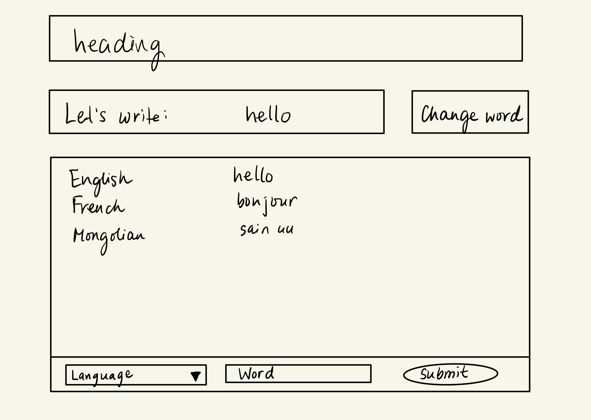
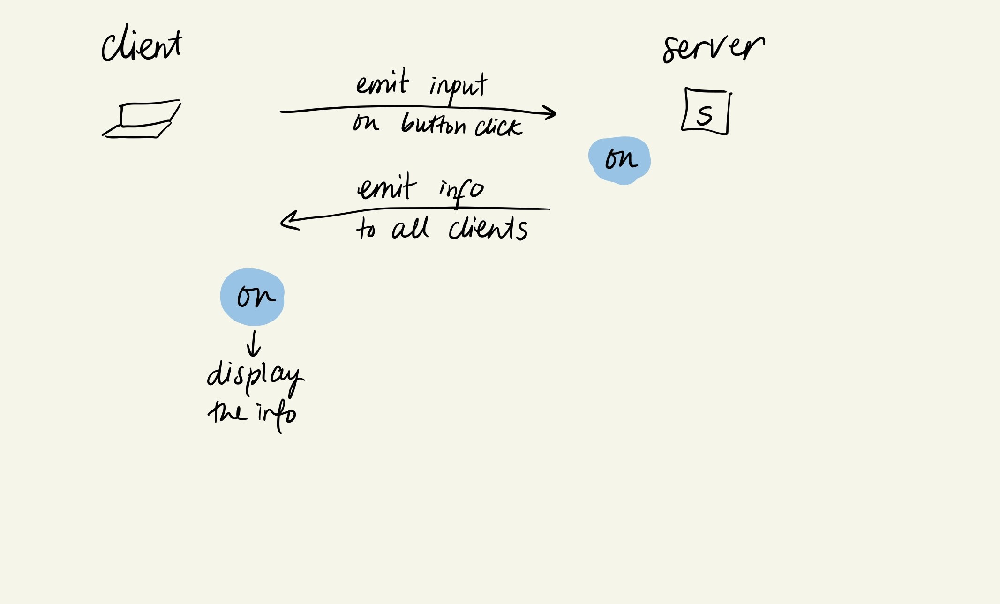

# Connections_Lab_Week8
Week 8 HW - Make a Node-Express app that incorporates Socket.io. Try to incorporate the following:
- At least one ‘emit’ event on the server-side and one ‘emit’ event on the client-side
- The ability to open 2 browser tabs and share data in real-time between the two

See project [here](https://connecting-languages.glitch.me//).

### Project Plan

In this homework, I thought about potential applications I could make and I was initially leaning towards making a version of a website that exists currently (I forgot the name) that allows attendees in a meeting to write words/phrases on a given topic and the largeness of each word font depends on how frequently the word is inputted by clients. But then I got kind of intimidated, as I wasn't sure how I could dynamically change the size of the words without making it ugly. So after thinking, I finally decided to create an application that is based on a similar idea, but is more focused on languages. Therefore, the application I created is a language-sharing/language-connecting website that allows people to write basic words and phrases in their own languages and share it with others. 

On the main page, the user will be able to get random words and translate the word in different languages using the drop down menu and input field. When they enter the translated word, it appears on the screen so that others can see. There is also a number board at the top right of the screen that keeps track of how many different languages the word is entered in. The app is meant to be a fun and educational app where people can easily learn simple words in many different languages.

### Process

I created a JSON file containing 16 basic words and phrases that people learn when they first start learning a new language. I also copy and pasted roughly all languages in the world into a JSON file to populate the dropdown menu for choosing the language of the word. Then I randomly choose a word from the JSON file and display it on the screen when the client clicks on the 'Get Word' button. At first, I randomly chose the word and displayed it strictly on the index.js file without using sockets and ended up with different words appearing on each client window. Then I realized that for all clients to get the same word and get the word updated whenever the button is pressed again, I should use sockets (send it to server first and display the information when the server send it back). The diagram I drew beforehand and the in-class codes were very helpful to add the interactions between the client and server. 

After finishing the website, I realized that users may find it hard at first to understand how it works, so I created an instructional landing page so that they can read a short info to understand the goal of the website. On top of practicing sockets and getting quite comfortable with it, I also got to practice appendChild, removeChild well. 

## Challenges & Next Steps

One thing that I wasn't able to figure out was correctly implementing error checking. I wanted to display an error/warning message whenever the client tried to submit partial input (without choosing a language or without inputting a word) and specifically send the message only to the client that did that action. I tried socket.emit and one other method that I found on stackoverflow but the message kept being displayed on all clients. 

Moreover, right now there are only 16 words in the JSON file, so when a word is randomly drawn, it may get repeated and the website can get boring after a while. In the future, it would be great if I expand the word options. All in all, this homework was a really great practice for Sockets and I feel so much more comfortable working with it now. 
